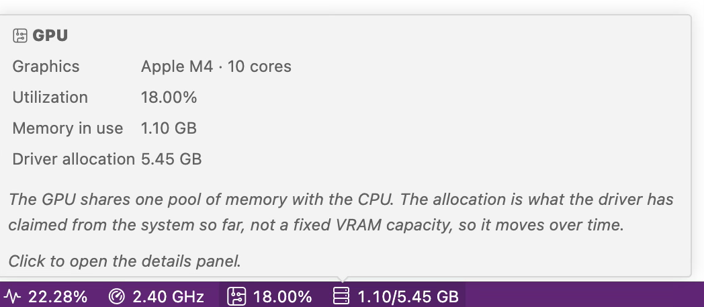
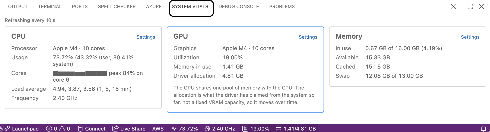

# System Vitals

Display CPU frequency and usage, GPU utilization, memory consumption, disk space, and battery percentage in the VS Code status bar — including **native Apple Silicon GPU monitoring**, which needs no elevated privileges.

> **A fork.** System Vitals is a fork of [resmon](https://github.com/Njanderson/resmon) by Nicholas Anderson, adding macOS GPU support and a modernized build. It is not affiliated with or endorsed by the original author. See [LICENSE.md](LICENSE.md) for the licensing situation, which is unresolved because the upstream project declares no license.

## Features

- **CPU** — usage percentage and current frequency
- **GPU** — utilization and memory in use (macOS, including M-series Apple Silicon)
- **Memory** — consumed out of total
- **Disk** — space remaining or used, per drive
- **Battery** — percentage remaining, hidden automatically on devices without a battery
- **Hover or click for detail** — every metric expands into the figures the status bar has no room for, as a hover or as a panel that stays put

## Screenshots

CPU usage, CPU frequency, GPU utilization and GPU memory, running on an Apple Silicon Mac. Each group is its own status bar entry. Disk space and CPU temperature are available as well, and are off by default.

Hovering a reading explains it, and nothing else. Here the GPU entry gives the accelerator's name and core count, its utilization, and memory in use against the driver's allocation — with a note about what that allocation actually is.

Clicking a reading opens the details view in the panel, beside Terminal and Problems, with the group you clicked outlined — the GPU here. Note that every figure matches the reading behind it in the status bar, down to the last decimal: one sample feeds both, so they cannot drift apart.

## Requirements

None beyond VS Code 1.74 or newer. The `systeminformation` module is bundled with the extension, and macOS GPU statistics are read from the IOKit registry with `ioreg`, which requires no additional software and no elevated privileges.

## Extension Settings

- `systemvitals.show.cpuusage`: Show CPU Usage. In Windows, this percentage is calculated with processor time, which doesn't quite match the task manager figure.
- `systemvitals.show.cpufreq`: Show CPU Frequency. This may just display a static frequency on Windows.
- `systemvitals.show.mem`: Show consumed and total memory as a fraction.
- `systemvitals.show.battery`: Show battery percentage remaining.
- `systemvitals.show.disk`: Show disk space information.
- `systemvitals.show.cputemp`: Show CPU temperature. May not work without the lm-sensors module on Linux. May require running VS Code as admin on Windows.
- `systemvitals.show.gpu`: Show GPU utilization. macOS only; see GPU Monitoring below.
- `systemvitals.show.gpumem`: Show GPU memory in use. macOS only; see GPU Monitoring below.
- `systemvitals.gpu.unit`: Unit used for GPU memory (GB-B).
- `systemvitals.disk.format`: Configures how the disk space is displayed (percentage remaining/used, absolute remaining, used out of totel).
- `systemvitals.disk.drives`: Drives to show, by mount point or device name. For example, `C:` on Windows, `/home` or `/dev/sda1` on Linux. Leave empty to pick sensible volumes automatically; see Disk Space below.
- `systemvitals.updatefrequencyms`: How frequently to query systeminformation, 10 seconds by default. This governs the hover details as well as the status bar; see Hovering for Detail below for why the default is unhurried. The minimum is 200 ms as to prevent accidentally updating so fast as to freeze up your machine.
- `systemvitals.freq.unit`: Unit used for the CPU frequency (GHz-Hz).
- `systemvitals.mem.unit`: Unit used for the RAM consumption (GB-B).
- `systemvitals.show.precision`: Number of decimal places shown for each figure, 0 to 2. Applies to the readings and to the details alike.
- `systemvitals.alignLeft`: Toggles the alignment of the status bar.
- `systemvitals.color`: Color of the status bar text in hex code (for example, #FFFFFF is white). The color must be in the format #RRGGBB, using hex digits.

## Hover and Click for Detail

The status bar has room for one number per metric. Hovering a reading gives that number its context; clicking opens the same detail in a view that stays put.

The readings sit in the status bar as five separate groups — CPU, GPU, Battery, Memory and Disk — and each answers for itself: hovering the GPU reading explains the GPU and nothing else. Each group can also be hidden on its own from the status bar's right-click menu, where they appear as "System Vitals GPU" and so on.

- **CPU** — the processor's name and core count, the user/system split behind the usage percentage, a bar per core showing whether the machine is evenly busy or one core is pinned, the 1/5/15 minute load averages, and the frequency spread across cores where the platform reports one.
- **GPU** — the accelerator's name and core count, utilization, and memory in use alongside the driver's allocation.
- **Memory** — memory in use as a percentage of total, memory still available, cache, and swap. Cache is memory the system hands back the moment anything wants it, which is why "used" so often looks alarming and is not.
- **Disk** — used, free, total and percentage for every volume shown, whichever single figure `systemvitals.disk.format` picks for the status bar.
- **Battery** — charge, whether it is charging or plugged in and idle, time remaining or time until full, health as a percentage of design capacity, and cycle count.

A hover elaborates on what is displayed, so a metric you have switched off, or one your machine cannot report, is absent from both — and a group with nothing left to show disappears from the status bar rather than sitting there empty. Rows whose underlying figure is unavailable are left out rather than shown as zero. Each metric is sampled once per update and feeds both the status bar and the hover, so the detail costs no extra polling.

### The details view

A hover lasts only as long as you hold the pointer still. Clicking a reading opens the same detail as a **System Vitals** tab in the panel, beside Terminal and Problems — directly above the readings themselves. It shows every group at once, updates in place, and outlines the group you clicked so you can find it.

It closes three ways, whichever you reach for first:

- the **✕** in its title bar
- clicking the same reading again
- **System Vitals: Close Details** on the command palette

Clicking a *different* reading keeps it open and moves the outline to that group instead. **System Vitals: Show Details** on the palette opens it without singling out any group.

Each group has a **Settings** button that opens the Settings editor filtered to that group — the disk group lands on the disk format and drive settings rather than the full list.

The panel carries no System Vitals tab until you ask for one, and closing the view takes the tab away again rather than leaving an empty shell behind. The view reads the same samples the status bar does rather than polling on its own, so it costs nothing while closed. It is treated as transient, so reloading the window closes it too; click a reading to bring it back.

### Why updates are unhurried

VS Code redraws an open hover the instant its content changes, so details rebuilt every couple of seconds flicker and resize while you are trying to read them. `systemvitals.updatefrequencyms` therefore defaults to 10 seconds, and it governs the reading and its details together — a panel always says exactly what the entry behind it says, never a sample or two out of date. Lower it if you want livelier numbers and don't mind the hover redrawing under the pointer.

## GPU Monitoring

GPU statistics are **macOS only**, and work on Apple Silicon (M-series) as well as Intel Macs. They are read from the IOKit registry with `ioreg`, which requires no elevated privileges — unlike `powermetrics`, which needs `sudo`. On any machine that does not report GPU statistics, both GPU metrics hide themselves automatically rather than showing an error.

- `systemvitals.show.gpu` displays GPU utilization as a percentage. This is the driver's instantaneous `Device Utilization %`, sampled at each update rather than averaged over the interval, so expect it to fluctuate the same way CPU usage does.
- `systemvitals.show.gpumem` displays GPU memory as *in use / allocated*. Note that this is **not** used-out-of-VRAM: Apple Silicon uses unified memory with no fixed GPU partition, so the second figure is how much system memory the GPU driver has currently claimed, not a fixed capacity. It moves over time.

GPU frequency and GPU power are not available, as both require `sudo powermetrics` or private APIs.

Linux and Windows GPU monitoring is not implemented; each would need a separate backend (`nvidia-smi` / `/sys/class/drm`, and WMI / NVML respectively).

## Disk Space

Disk space is off by default. Enable it with `systemvitals.show.disk`.

macOS reports eight APFS volumes for a single physical disk, so with no `disk.drives` set the extension picks the one that answers the question. That matters more than it sounds: `/` on modern macOS is the sealed, read-only system snapshot, and it reports roughly 95% free no matter how full the machine actually is. The volume holding your files is mounted at `/System/Volumes/Data`, and that is what gets shown, labelled `/`.

On other platforms every real filesystem is shown. Volumes with no capacity, such as `devfs`, are skipped everywhere.

To choose specific volumes yourself, set `systemvitals.disk.drives` to a list of mount points or device names. Anything listed there is shown as-is, including volumes the automatic selection would skip.

## Known Issues

A better solution for Windows CPU Usage would be great. I investigated alternatives to counting Processor Time, but none of them seemed to match the Task Manager percentage.

---

## Change Log

See [CHANGELOG.md](CHANGELOG.md).
